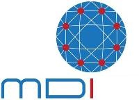
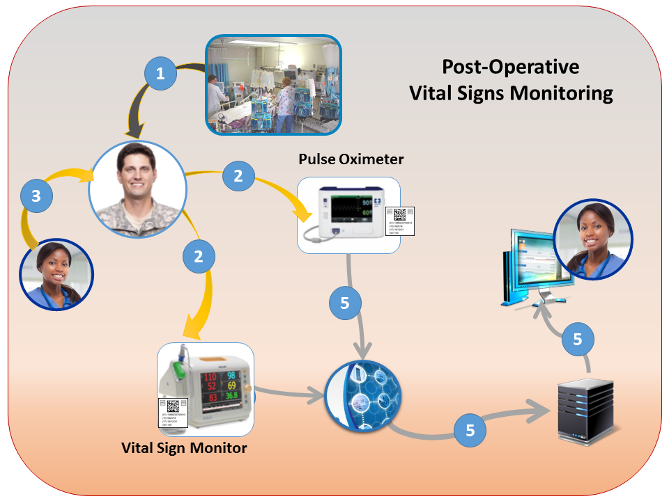

# Medical Device Integration Adapter (MDIA)

The VHA Medical Device Interoperability Program (MDIP) was a response to clinician concerns that medical device integration lacked consistency, usability, and failed to associate device-generated information with patients records. The latter is a major patient safety concern if incorrect data is used within treatment decisions. The solution is to accelerate the adoption of industry best-practices and health IT standards for uniform, patient-centered interoperability across the enterprise and the continuum of care regardless of system type or vendor.

An open-source, pilot Medical Device Integration Adapter (MDIA) has been developed to record standards-based medical device information automatically. The demonstration illustrates the benefits of standard frameworks like Integrating the Healthcare Enterprise (IHE) to integrate information from any standards-based system into the enterprise (e.g. VistA application), without vendor-specific customizations.  The Vital Signs Monitoring scenario is equally applicable to other care settings and situations (e.g. remote monitoring). The MDIA demonstration is an objective illustration of the power of standardization to reduce the cost, variability, and uncertainty of medical device integration, as well as the creation of scalable solutions that improve patient safety. 

